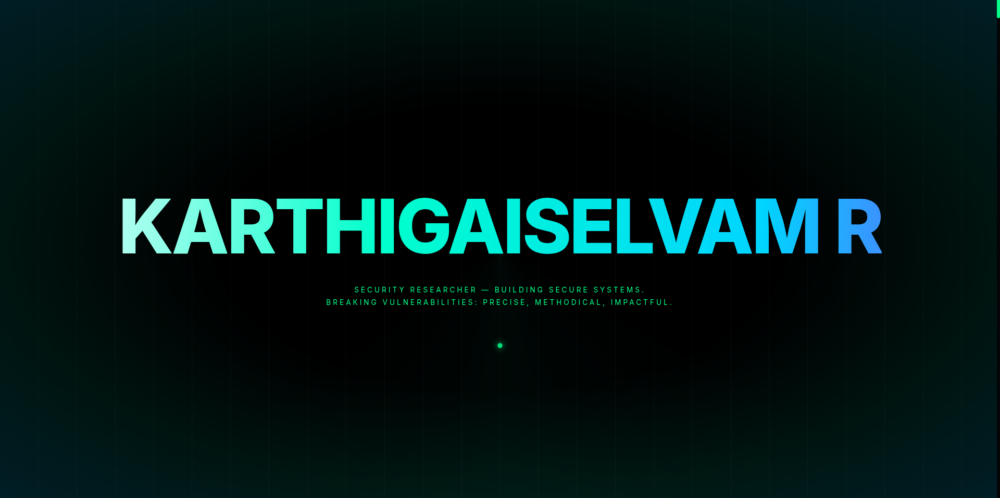

# 🔐 Karthigaiselvam R - Portfolio

> **Security Researcher & Software Developer**  
> *Exploring the intersection of secure infrastructure and modern web experiences.*


A highly interactive, cyber-security themed portfolio website built to showcase penetration testing achievements, software development projects, and professional experience.

---

## 💬 A Note to Everyone Who Finds This

Hey — whether you're a stranger, a friend, a brother, a sister, a fellow developer, or just someone who stumbled here:

**Cloning this and swapping out my details? Totally fine.** That's what open source is for.

But here's what I'd love even more —

> *Don't just copy. Create.*\
> Take this code, understand it, tear it apart, rebuild it better.\
> Add your own personality. Your own design language. Your own signature.\
> Make something that makes people say **"who built this?"** — and the answer is unmistakably **you**.

Copying is a good starting point. But showing your own creativity and innovativeness — making something **completely better than this** — that's the real goal.

As the developer who built this from scratch, nothing would make me prouder than knowing this was the foundation for something even greater. Your signature on your work, with a quiet nod to where it began — that's what I hope for.

**Build something worth remembering. 🚀**

---

## 📸 Screenshots

<p align="center">
  
</p>

<p align="center">
  
  
</p>

<p align="center">
  
  
</p>

<p align="center">
  
</p>

---

## ✨ Key Features

- **🎨 Cyber Aesthetic**: Custom neon design system with glassmorphism, matrix rain, and glitch effects.
- **📱 Responsive Design**: Fully optimized for Desktop, Laptop, Tablet, and Mobile devices.
- **✉️ Secure Contact Form**: 
    - Integrated with **EmailJS** for serverless, secure email delivery.
    - Custom **Toast Notification System** for real-time user feedback.
    - Rate limiting and input validation.
- **🏗️ Dynamic Architecture**:
    - **Experience Timeline**: Vertical interactive timeline connecting internships to LinkedIn posts.
    - **Achievement Carousel**: Auto-playing image gallery for hackathon wins and certifications.
    - **Project Hub**: GitHub API integration to fetch and display live repository statistics.
- **👁️ Self-Owned Visitor Counter**:
    - Counts total visitors with a glitch-effect animation on the intro screen.
    - Backed by a **private GitHub Gist** — zero third-party dependency, no service can shut it down.
    - Served via a Vercel Serverless Function to keep the GitHub token off the browser.

## 🛠️ Tech Stack

- **Frontend**: React 18
- **Build Tool**: Vite
- **Animations**: Framer Motion
- **Styling**: CSS Modules with CSS Variables (Theming)
- **Email Service**: EmailJS
- **Icons**: Lucide React / Custom SVG

## 🚀 Quick Start

1. **Clone the repository**
   ```bash
   git clone https://github.com/Karthigaiselvam-R-official/Karthigaiselvam-dev.git
   ```

2. **Install dependencies**
   ```bash
   cd Karthigaiselvam-dev
   npm install
   ```

3. **Set up environment variables**
   ```bash
   cp .env.example .env.local
   # Fill in your values — see .env.example for instructions
   ```

4. **Start local server**

   **Option A** — Full dev (frontend + visitor counter API):
   ```bash
   npx vercel dev
   ```

   **Option B** — Frontend only (counter shows `000000`, intro still exits normally):
   ```bash
   npm run dev
   ```

5. **Build for production**
   ```bash
   npm run build
   ```

## 📁 Project Structure

```bash
api/
└── visits.js         # Serverless function — self-owned visitor counter via GitHub Gist
src/
├── components/
│   ├── Navbar/       # Responsive navigation with 'terminal' style
│   ├── Hero/         # 3D interactive landing section
│   ├── Intro/        # Animated intro screen with live visitor counter
│   ├── About/        # Profile & Achievements with Carousel
│   ├── Experience/   # Vertical Professional Timeline
│   ├── Projects/     # GitHub API integrated project cards
│   ├── Contact/      # EmailJS form with validation
│   └── Toast/        # Custom notification system
├── styles/
│   └── global.css    # Cyber-theme variables & animations
└── main.jsx          # Entry point
```

## 🔑 Environment Variables

Copy `.env.example` to `.env.local` and fill in your values:

```bash
cp .env.example .env.local
```

| Variable | Description |
|---|---|
| `GITHUB_GIST_TOKEN` | GitHub PAT with `gist` scope — used by the visitor counter |
| `GITHUB_GIST_ID` | ID of your private Gist (`visitor-count.json`) |
| `VITE_GITHUB_TOKEN` | GitHub PAT for fetching live repo stats in the Projects section |

See `.env.example` for full setup instructions. For production, add these to **Vercel → Settings → Environment Variables**.

## 📧 Contact Configuration

To make the contact form work in your own fork:

1. Create an account on [EmailJS](https://www.emailjs.com/).
2. Create a standardized email template.
3. Update specific keys in `src/components/Contact/Contact.jsx` or use Environment Variables.

## 📄 License

This project is licensed under the MIT License - see the [LICENSE](LICENSE) file for details.


---

<p align="center">
  
  
  
</p>

<p align="center">
  <em>Not a template. Not a clone. Built from scratch — where code meets identity.</em><br/>
  <em>I am <a href="https://github.com/Karthigaiselvam-R-official"><strong>Karthigaiselvam R</strong></a> — this is my <strong>Digital Identity</strong>.</em>
</p>

<p align="center">
  <a href="https://github.com/Karthigaiselvam-R-official">
    
  </a>
  <a href="https://www.linkedin.com/in/karthigaiselvam-r-7b9197258">
    
  </a>
</p>

<p align="center">
  <sub>If this project helped or inspired you — drop a ⭐ It means a lot.</sub>
</p>
